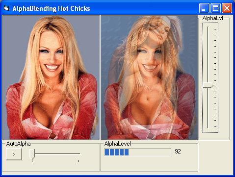



## Alpha Blending \- using AlphaBlend API

### Description

Alpha Blending is a hot topic in the graphics world. This code is an example of how to use the API for Alpha Blending. This code is well commented, and I am active with all of my projects. Any input is also welcome.
 
### More Info
 

             |
---                |---
**Submitted On**   |2004-12-12 13:06:20
**By**             |[Aaron V\. DeRenard](https://github.com/Planet-Source-Code/PSCIndex/blob/master/ByAuthor/aaron-v-derenard.md)
**Level**          |Advanced
**User Rating**    |4.7 (33 globes from 7 users)
**Compatibility**  |VB 5\.0, VB 6\.0
**Category**       |[Graphics](https://github.com/Planet-Source-Code/PSCIndex/blob/master/ByCategory/graphics__1-46.md)
**World**          |[Visual Basic](https://github.com/Planet-Source-Code/PSCIndex/blob/master/ByWorld/visual-basic.md)
**Archive File**   |[Alpha\_Blen18285912122004\.zip](https://github.com/Planet-Source-Code/aaron-v-derenard-alpha-blending-using-alphablend-api__1-57693/archive/master.zip)

